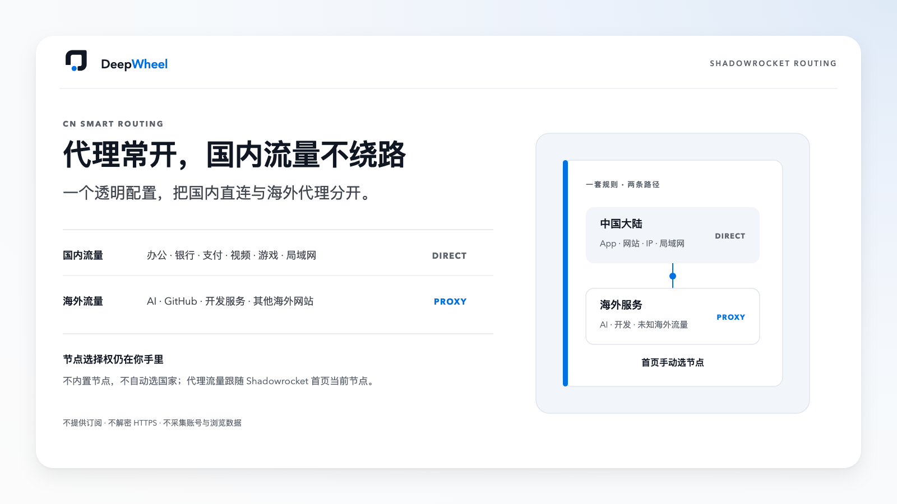
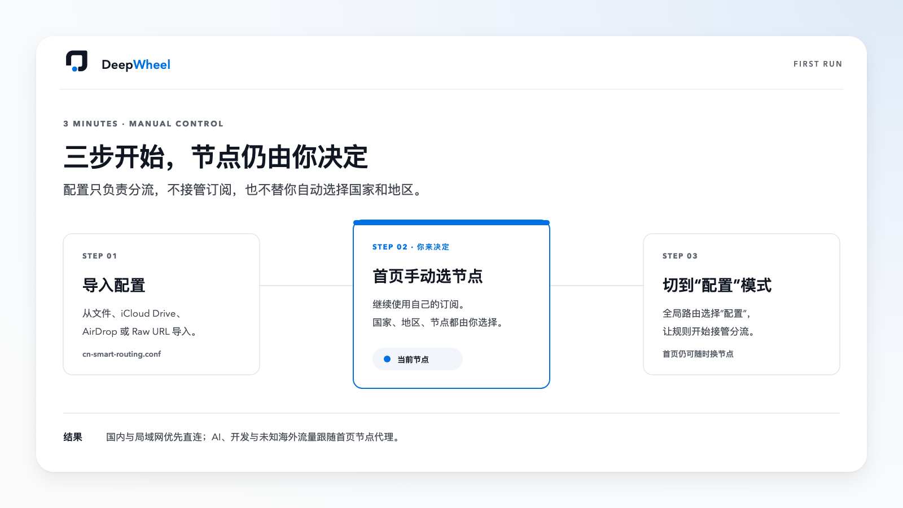
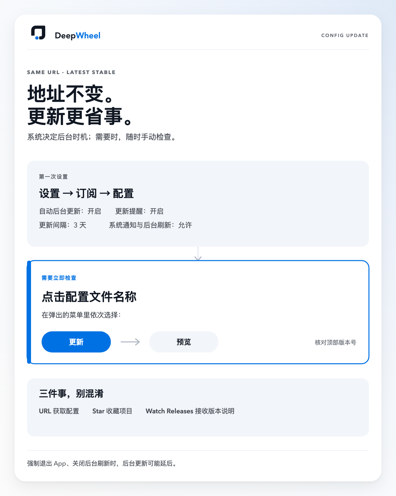
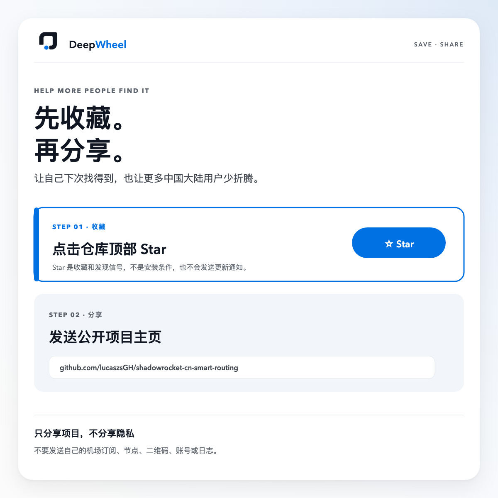
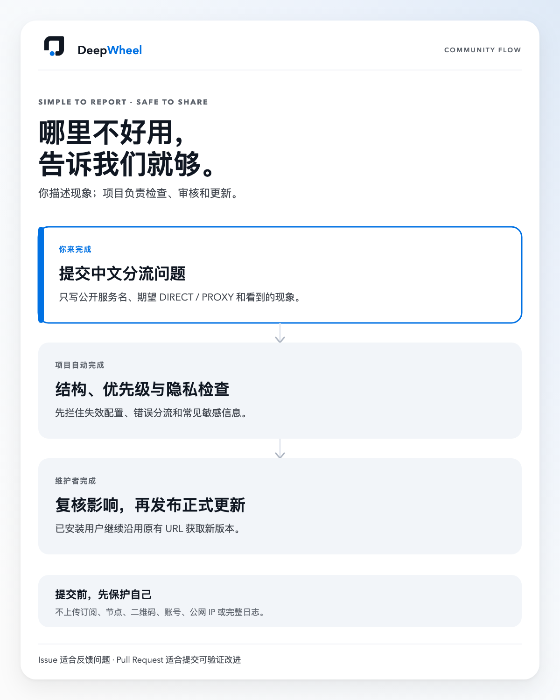

# CN Direct by DeepWheel｜Shadowrocket 中国大陆长期常开配置

**简体中文**｜[English](README.en.md)

面向已经拥有节点订阅的中国大陆 Shadowrocket 用户。国内与局域网优先直连，海外 AI、开发与其他流量继续跟随你在首页手动选择的节点。



## 小火箭一直开。国内应用照常用。

开着 Shadowrocket，不该意味着国内流量也要绕远路。

CN Direct 只做一件事：把国内和海外流量送上各自的路径。节点仍由你选择，订阅仍由你的服务商提供。

### 找到有用的，先收藏

点击仓库顶部的 **Star**，方便稍后回来安装，也能让更多中国大陆用户发现这份配置。

> Star 用来收藏和帮助项目被发现，不会自动发送更新通知，也不是安装条件。

## 124,653｜251｜0

| 信任证据 | 对你意味着什么 |
|---|---|
| **124,653 条**中国大陆匹配规则 | 从常见域名到中国大陆 IP，减少国内流量误走海外节点 |
| **251 个**上游子规则集合 | 覆盖银行、支付、运营商、办公、影音、游戏与生活服务 |
| **0 节点、0 订阅、0 MITM、0 脚本** | 配置只负责分流，不接管你的订阅或账号 |

当前锁定快照还包含 **112,138 条域名及域名后缀规则**和 **12,436 个中国大陆 IP 网段**。这些数字代表匹配体量，不等于 App 数量，也不是零延迟保证。[查看固定版本证据](https://github.com/blackmatrix7/ios_rule_script/blob/e69663d642551aa3e0164a656179335a896127ad/rule/Shadowrocket/ChinaMax/README.md)。

## 不该每次上网，都先切一次开关

- 开着小火箭，担心国内办公、视频和游戏绕远路；
- 关掉小火箭，ChatGPT、Claude 和 GitHub 又会中断；
- 换一份配置，还要研究黑白名单、策略组和自动选节点。

CN Direct 不让你再做这道选择题：

- **国内优先直连**：微信、飞书、钉钉、会议、银行支付、影音、游戏与局域网；
- **海外照常代理**：ChatGPT、Claude、Gemini、GitHub、Docker、npm、PyPI 等；
- **节点仍由你选择**：不自动测速选区，不建立多套策略组；
- **未知海外流量兜底代理**：前面未命中的海外服务继续跟随首页节点。

## 为什么不是直接用其他方案

| 常见选择 | 更适合什么情况 |
|---|---|
| Shadowrocket 默认配置 | 希望零安装，基础分流已经够用 |
| 机场提供的配置 | 希望节点与规则由同一服务商统一管理 |
| 大型规则仓或多版本懒人配置 | 愿意自己选择、组合和维护规则 |
| **CN Direct** | 想要一份中国大陆长期常开成品配置，只在首页选择节点 |

CN Direct 不追求规则版本最多、广告拦截最强或客户端最多。它选择的是：**一份配置、一条入口、更少日常操作**。[查看完整定位对比](docs/zh-cn/project-comparison.md)。

## 还没有 Shadowrocket？

**[前往美区 App Store 下载（推荐）](https://apps.apple.com/us/app/shadowrocket/id932747118)**

已有港区 Apple ID？[使用港区 App Store 下载](https://apps.apple.com/hk/app/shadowrocket/id932747118)。

同一个官方应用支持 iPhone、iPad 和 Mac。中国大陆区 App Store 当前未上架，请使用本人合法持有的对应地区 Apple 账号；不要使用共享账号或来历不明的安装包。

## 三步装好

### 1. 准备自己的节点

先在 Shadowrocket 中导入并更新自己的机场订阅，在首页选择一个已经验证可用的节点。本项目不提供、读取或保存订阅。

### 2. 复制稳定配置 URL

```text
https://raw.githubusercontent.com/lucaszsGH/shadowrocket-cn-smart-routing/main/configs/shadowrocket/CN-Direct-DeepWheel.conf
```

在 Shadowrocket 的“配置”页通过远程 URL 添加。配置真源为 [`CN-Direct-DeepWheel.conf`](configs/shadowrocket/CN-Direct-DeepWheel.conf)。

### 3. 使用配置

1. 在“配置”列表点击 `CN-Direct-DeepWheel.conf` 的**文件名称**；
2. 在弹出的菜单中点击“使用配置”；
3. 返回首页，将“全局路由”设为“配置”；
4. 开启 Shadowrocket，节点仍在首页手动选择。

> 关键位置是点击配置文件名称，不是在右侧寻找信息符号。不同设备版本的排版可能略有差异。



## 30 秒确认已经生效

依次检查：

1. 打开一个常用国内网站或 App；
2. 打开 GitHub 或一个海外 AI 服务；
3. 在首页切换一次节点，确认海外服务跟随新节点。

三项都正常，就可以保持“配置”模式使用。涉及银行、会议、视频、游戏和局域网时，再按[完整首次验收清单](docs/zh-cn/quick-start.md)检查。

> 如果启用后异常，立即切回之前的配置或关闭 Shadowrocket，再查看[排查指南](docs/zh-cn/troubleshooting.md)。

## 地址不变。更新更省事。

通过上面的稳定 URL 安装后，后续正式版本继续沿用同一地址，不需要重新下载或删除配置。

第一次设置：

```text
设置 → 订阅 → 配置
自动后台更新：开启
更新提醒：开启
更新间隔：3 天
```

同时允许 Shadowrocket 使用系统“后台 App 刷新”和通知。iOS、iPadOS 和 macOS 决定后台任务何时运行，因此不承诺每次发布后立即完成后台更新。

需要立即检查时：

> 配置列表 → 点击配置文件名称 → 更新 → 预览版本



- **URL**：让 Shadowrocket 获取最新版配置；
- **Star**：收藏项目，不会发送更新通知；
- **Watch → Custom → Releases**：可选，用于接收 GitHub 正式版本说明。

## 好用，就分享出去

把项目主页发给朋友即可：

```text
https://github.com/lucaszsGH/shadowrocket-cn-smart-routing
```



你分享的是公开项目，不是自己的节点、机场订阅或账号。朋友需要准备自己的 Shadowrocket 和节点，再按本页步骤导入。

## 高频场景，单独照顾

CN Direct 使用固定到已验证提交的 ChinaMax 作为大陆覆盖基础，同时把容易被大规则误判的海外 AI、开发和办公服务放在它之前明确代理。

国内侧还显式保护：

- 飞书、妙记、微信、企业微信、钉钉；
- 腾讯会议、会记及相关信令和录制同步域名；
- 常见商业银行、银联和支付宝；
- Apple 中国大陆、iCloud、云上贵州相关服务；
- 私有地址、`.local`、`.lan` 与常见局域网发现流量。

发布验证曾对飞书参考域名完成 **35/35** 覆盖审计，对腾讯会议公开防火墙清单完成 **64/64** 泛域名覆盖审计。清单覆盖不等于所有网络中的真实通话都零卡顿；会议质量仍受 Wi-Fi、运营商、设备和节点状态影响。[查看实时通信说明](docs/zh-cn/realtime-communications.md)。

## 适用范围与边界

| 客户端 | 状态 |
|---|---|
| iPhone / iPad Shadowrocket | 支持，使用同一配置 |
| macOS Shadowrocket | 支持，使用同一配置；TUN 由应用设置管理 |
| Apple TV | 尚未独立验证 |
| Clash/Mihomo、Surge、Quantumult X、sing-box | 不能直接导入本文件 |

需要提前知道：

- 部分银行只要检测到系统 VPN 就会提示异常，即使流量已经 `DIRECT`；
- 节点质量、地区适配和账号访问不由本配置保证；
- 本项目不能避免 ChatGPT、Claude 等平台的账号风控；
- 不承诺所有设备、网络和场景完全零延迟变化；
- 本地修改会在远程配置更新时被覆盖。

## 遇到问题，一起把它做得更好

- 只知道哪里不好用：提交[分流问题](https://github.com/lucaszsGH/shadowrocket-cn-smart-routing/issues/new?template=routing-problem.yml)；
- 知道需要补哪个公开域名：提交[规则建议](https://github.com/lucaszsGH/shadowrocket-cn-smart-routing/issues/new?template=rule-request.yml)；
- 想直接改进配置或文档：查看[参与贡献](CONTRIBUTING.md)并提交 Pull Request。

不要公开提交订阅 URL、节点、二维码、Cookie、Token、公网 IP、账号信息或完整日志。



## 帮助与进阶

- [快速开始与完整首次验收](docs/zh-cn/quick-start.md)
- [常见问题](docs/zh-cn/faq.md)
- [问题排查](docs/zh-cn/troubleshooting.md)
- [国内实时通信与会议分流](docs/zh-cn/realtime-communications.md)
- [相似项目与定位对比](docs/zh-cn/project-comparison.md)
- [Fork 后自定义](docs/zh-cn/customization.md)
- [为什么采用这种设计](docs/zh-cn/design-principles.md)

<details>
<summary><strong>版本、校验与许可证</strong></summary>

当前正式版本：`0.2.0`。

[](https://github.com/lucaszsGH/shadowrocket-cn-smart-routing/actions/workflows/validate.yml)
[](https://github.com/lucaszsGH/shadowrocket-cn-smart-routing/releases)
[](LICENSE)

本地校验：

```bash
python3 scripts/validate_shadowrocket.py
python3 scripts/validate_shadowrocket.py --network
python3 scripts/validate_shadowrocket.py --audit-realtime-upstreams
```

配置引用 [`blackmatrix7/ios_rule_script`](https://github.com/blackmatrix7/ios_rule_script) 的固定版本规则，并从采用 Unlicense 的 [`icewithcola/Clash-Rule-Set`](https://github.com/icewithcola/Clash-Rule-Set) 选择性整理少量飞书域名。详见 [THIRD_PARTY.md](THIRD_PARTY.md)。

配置与仓库代码采用 GPL-2.0。DeepWheel 名称与品牌标志单独遵循 [NOTICE.md](NOTICE.md)。

</details>
