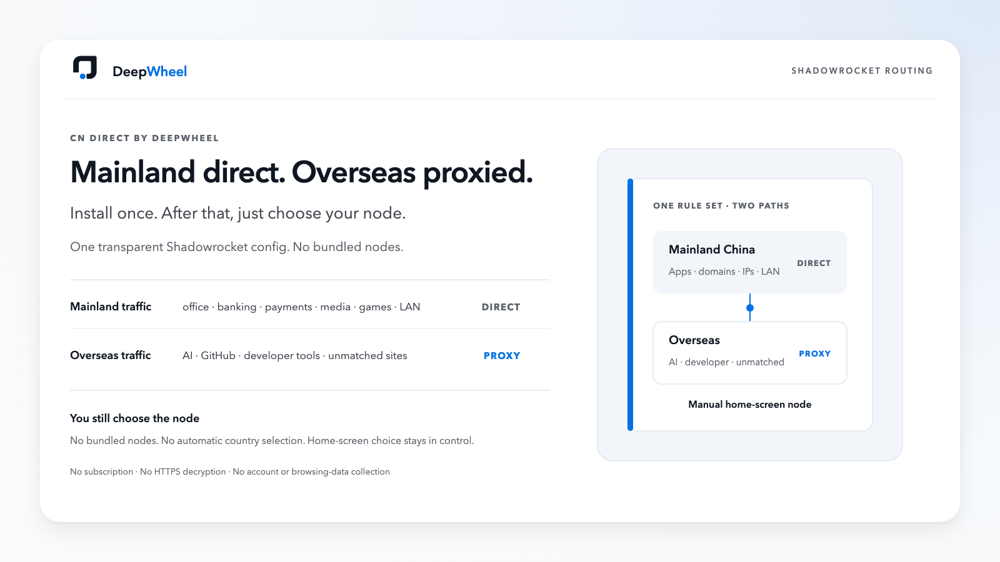
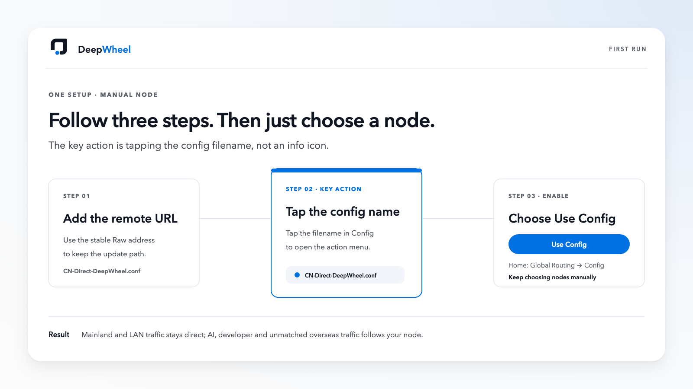
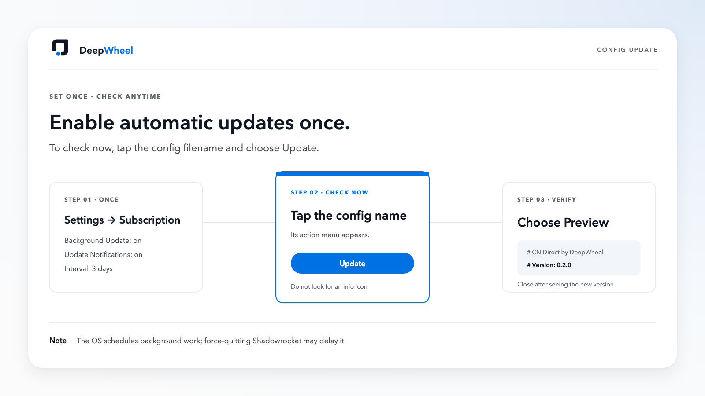

# CN Direct by DeepWheel — Shadowrocket routing for mainland China

**English** | [简体中文](README.zh-CN.md)

Status: release candidate. Current version: `0.2.0-rc.2`.

[](https://github.com/lucaszsGH/shadowrocket-cn-smart-routing/actions/workflows/validate.yml)
[](https://github.com/lucaszsGH/shadowrocket-cn-smart-routing/releases)
[](LICENSE)

An open-source **Shadowrocket configuration for mainland China**. Mainland office tools, banking, payments, media, games and local-network traffic stay direct, while ChatGPT, Claude, Gemini, GitHub and other overseas services follow the node you select on the Shadowrocket home screen.



## Mainland direct. Overseas proxied.

**Set it up once. After that, just choose your node.**

CN Direct does not provide nodes or choose a country for you. It only sends mainland and overseas traffic down the right paths, so Shadowrocket can stay enabled while node control remains on the home screen.

## The one installation path

CN Direct recommends one method only: **install the remote configuration URL**. This lets Shadowrocket continue checking the stable configuration after first-time setup.

### 1. Prepare your own node

Import your own provider subscription in Shadowrocket and select a working node on the home screen. This project never provides, reads or stores that subscription.

### 2. Copy the stable configuration URL

```text
https://raw.githubusercontent.com/lucaszsGH/shadowrocket-cn-smart-routing/main/configs/shadowrocket/CN-Direct-DeepWheel.conf
```

In Shadowrocket, open **Config** and add this address as a remote URL. GitHub strips `shadowrocket://` custom-protocol links, so this project does not present a one-click button that may silently fail.

Canonical source: [`configs/shadowrocket/CN-Direct-DeepWheel.conf`](configs/shadowrocket/CN-Direct-DeepWheel.conf)

### 3. Use Configuration mode

1. In the Config list, **tap the `CN-Direct-DeepWheel.conf` filename**.
2. Choose **Use Config** from the action menu.
3. Return home and set Global Routing to **Config**.
4. Enable Shadowrocket.
5. Keep selecting your own nodes on the home screen.

> Key location: tap the configuration filename rather than looking for an information icon. Layout may vary slightly across Shadowrocket device versions.



### 4. Enable updates once

In Shadowrocket, open the configuration-update area under **Settings → Subscription**:

```text
Automatic Background Update: on
Update Notifications: on
Update Interval: 3 days
```

Also allow Background App Refresh and notifications for Shadowrocket in iOS/iPadOS Settings. Menu labels may differ slightly between app versions.

To check immediately, tap the configuration filename in the Config list, choose **Update**, then choose **Preview** to verify the version at the top. This manual path has been verified in Shadowrocket on macOS.



> The config also embeds the same stable `update-url` so a recovery import retains an update address; remote-URL import remains the only recommended setup. iOS may delay background work after Shadowrocket is force-quit or Background App Refresh is disabled. Remote updates also overwrite local edits.

## Not more rules. Fewer interruptions.

CN Direct uses ChinaMax pinned to a reviewed commit as its mainland coverage layer. Explicit overseas AI, developer and work rules come first, preventing a large mainland list from misrouting those services.

The pinned snapshot contains:

| Verifiable coverage evidence | Count |
|---|---:|
| Total matching rules | **124,653** |
| Domain and domain-suffix rules | **112,138** |
| Mainland IP ranges | **12,436** |
| Explicitly listed upstream sub-rule sets | **251** |

These figures come from the ChinaMax snapshot dated `2026-07-20`. They measure matching volume, not 124,653 apps, and do not promise zero latency change on every device or network. [Inspect the pinned evidence](https://github.com/blackmatrix7/ios_rule_script/blob/e69663d642551aa3e0164a656179335a896127ad/rule/Shadowrocket/ChinaMax/README.md).

## Your node remains your choice

- Use your own provider subscription.
- Choose country, region and node manually on the home screen.
- No automatic node selection or complex policy groups.
- No bundled node, subscription URL, script, MITM or certificate.
- Unmatched overseas traffic follows the currently selected node.

## Routing at a glance

| Traffic | Examples | Route |
|---|---|---|
| Mainland office and real-time communication | Feishu, Minutes, Tencent Meeting, WeChat, WeCom | `DIRECT` |
| Mainland banking and payments | major banks, UnionPay, Alipay | `DIRECT` |
| Mainland media and games | Bilibili, Douyin, Tencent, NetEase | `DIRECT` |
| Apple services in mainland China | Apple China, iCloud, Guizhou-Cloud related services | `DIRECT` |
| Local network | private IP ranges, `.local`, `.lan` | `DIRECT` |
| AI | ChatGPT, OpenAI API, Claude, Gemini, Perplexity | `PROXY` |
| Developer services | GitHub, Copilot, Docker Hub, npm, PyPI, JetBrains | `PROXY` |
| Overseas work tools | Notion, Slack, Teams, Discord, OneDrive | `PROXY` |
| Unmatched traffic | anything not matched earlier | `PROXY` |

## Device support

| Client | Status | Notes |
|---|---|---|
| Shadowrocket on iPhone/iPad | Supported | Uses the same `CN-Direct-DeepWheel.conf` |
| Shadowrocket on macOS | Supported | Uses the same config; TUN is managed in the app |
| Apple TV | Not independently verified | Not part of the supported matrix yet |
| Clash/Mihomo, Surge, Quantumult X, sing-box | Not supported | Do not import this file directly |

## Capability boundary

Supported: Shadowrocket Config-mode routing, mainland-first direct rules, overseas proxy rules, explicit mainland meeting and recording-sync domains, manual node selection, a stable embedded update URL, pinned upstreams and automated structural/privacy checks.

Still requires real-device confirmation: bank-app VPN detection, node quality, region suitability, sleep/wake, Wi-Fi/cellular switching, captive portals, calls, meetings, long sessions and OS-scheduled background-update timing. The manual Update → Preview path has passed a macOS Shadowrocket test.

Not promised: nodes or accounts, automatic country selection, avoidance of platform account restrictions, zero latency change, Apple TV support, or bypassing laws and service terms.

## Installed successfully?

If CN Direct saves you from toggling Shadowrocket even once, please **Star** the repository. It helps you find the project again and helps more mainland-China users discover it.

- **Automatic configuration updates:** use the stable URL above and enable config updates in Shadowrocket.
- **Release explanations:** choose `Watch → Custom → Releases` in the repository header.
- **Problems and improvements:** use Issues or Pull Requests without posting subscription URLs, nodes, cookies, tokens, public IPs or full logs.

Star bookmarks. Watch notifies. The URL updates.

## Help and customization

- [Chinese quick start and acceptance checks](docs/zh-cn/quick-start.md)
- [Chinese troubleshooting guide](docs/zh-cn/troubleshooting.md)
- [Real-time communication routing](docs/zh-cn/realtime-communications.md)
- [Fork-based customization](docs/zh-cn/customization.md)
- [Design principles](docs/zh-cn/design-principles.md)

Local files, iCloud Drive and AirDrop are recovery options when remote URL import is unavailable, not competing installation paths.

## Validation

```bash
python3 scripts/validate_shadowrocket.py
python3 scripts/validate_shadowrocket.py --network
python3 scripts/validate_shadowrocket.py --audit-realtime-upstreams
```

The validator does not replace a real Shadowrocket import or real-device traffic test.

## Third-party rules and license

The configuration references pinned rules from [`blackmatrix7/ios_rule_script`](https://github.com/blackmatrix7/ios_rule_script) and selectively adapts a small set of Feishu domains from the Unlicense-licensed [`icewithcola/Clash-Rule-Set`](https://github.com/icewithcola/Clash-Rule-Set). See [THIRD_PARTY.md](THIRD_PARTY.md).

Configuration and repository code are GPL-2.0 licensed. DeepWheel names and brand marks are covered separately in [NOTICE.md](NOTICE.md).
